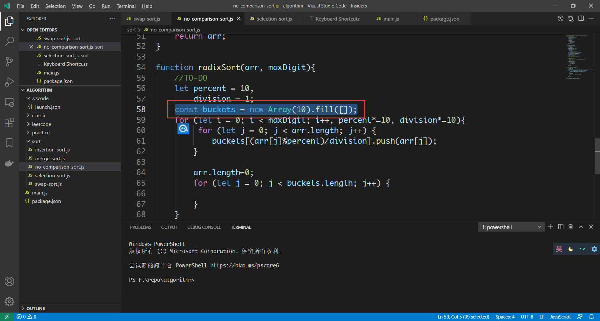
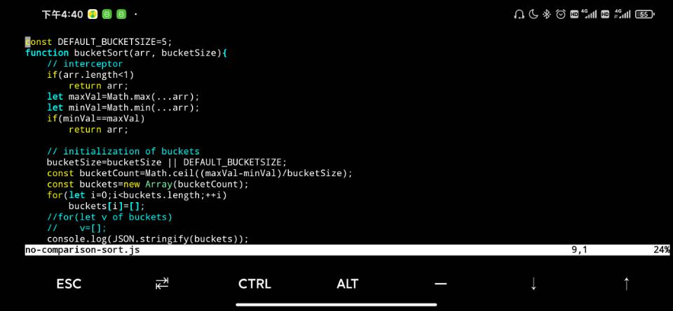
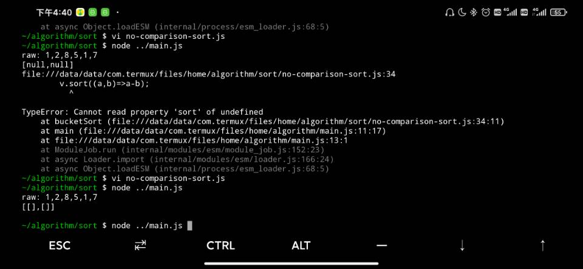
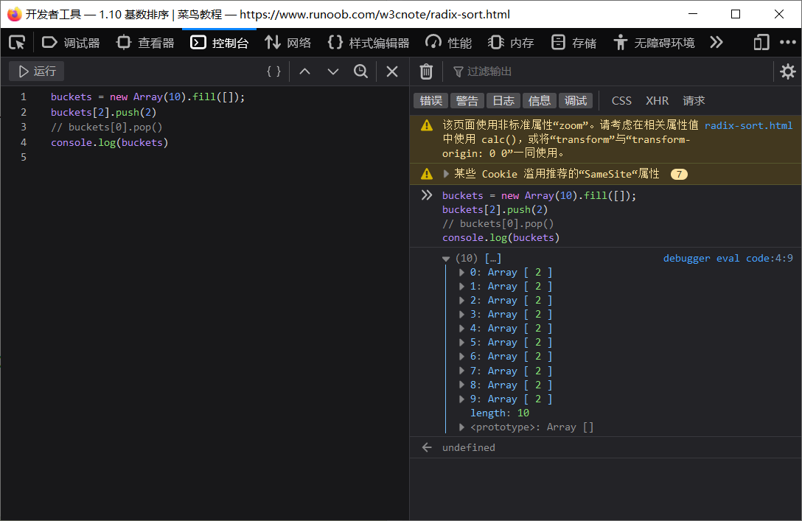
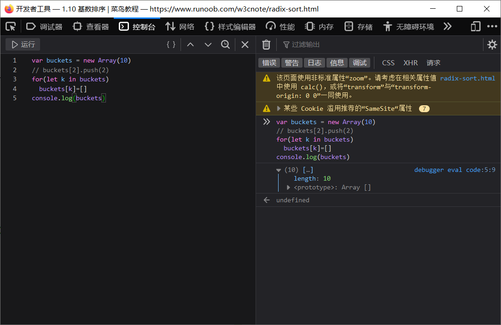
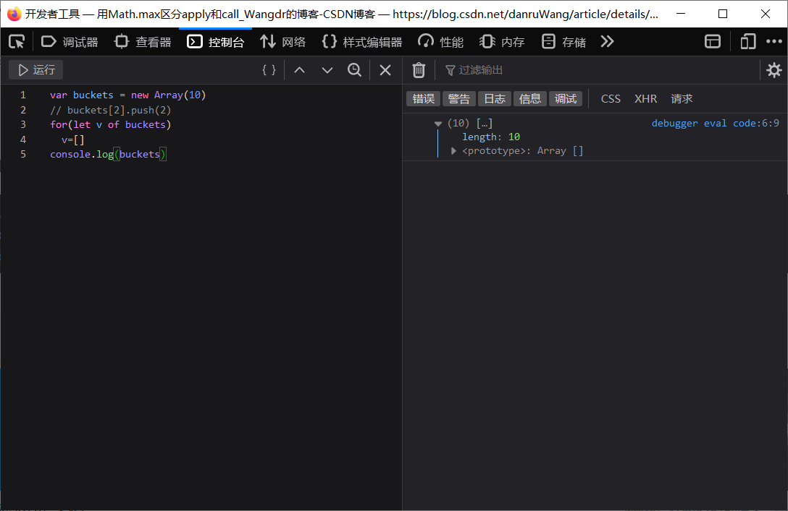
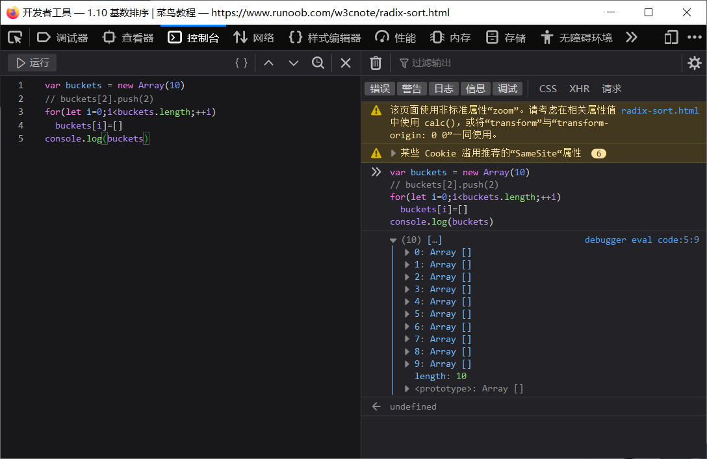
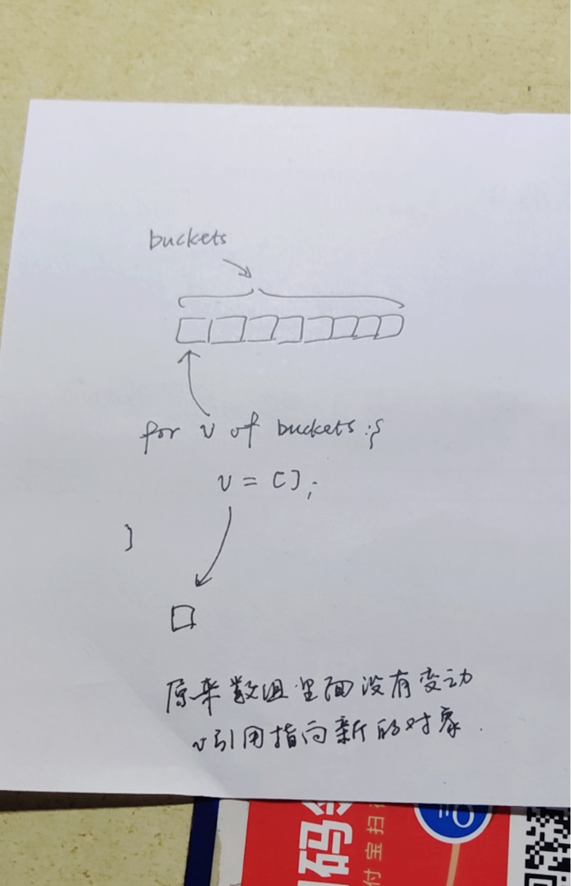

#### 问题由来: 对基数排序中桶数组用Array.prototype.fill 初始化失败, 昨天在写桶排序的时候, 也遇到了类似的问题: 对桶数组用for of 语法初始化失败

##### radix排序

##### 桶排序

可以猜到fill方法是失败的, 去验证一下:
##### fill方法

##### 联想到for of 和 for in

##### 正常的for循环肯定是正确的

##### 原因(待深究)
